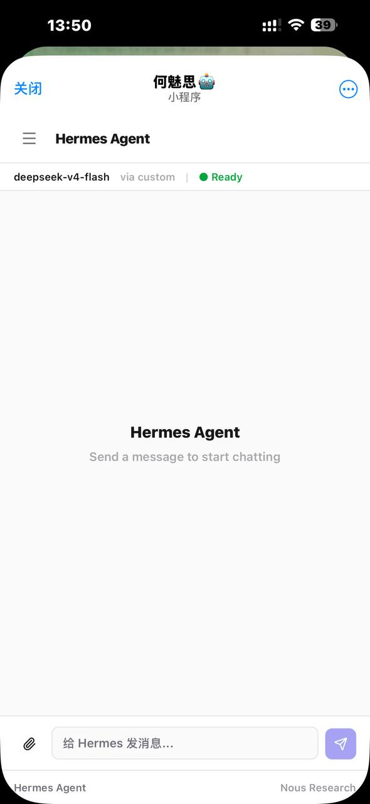
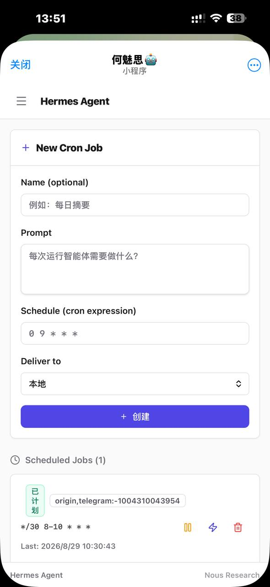
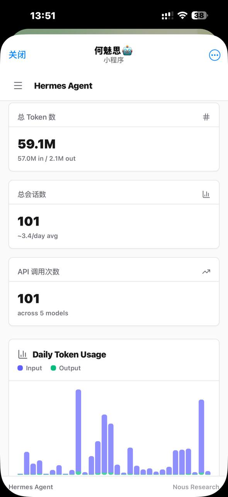
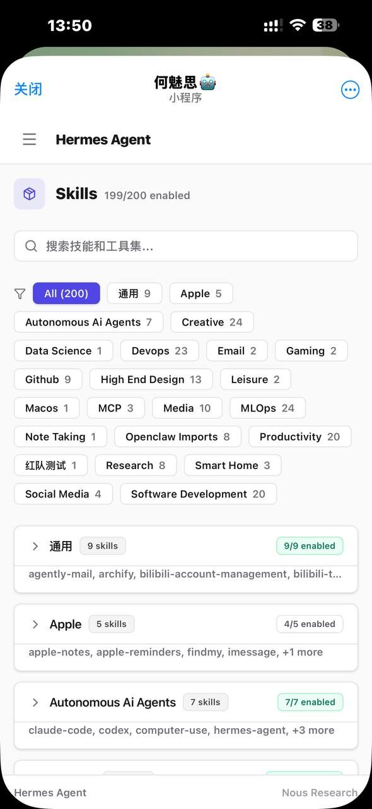

# Hermes Telegram Mini App

[English](README.md) · [简体中文](README.zh-CN.md)

在 Telegram 里以 Mini App 方式运行的 Hermes Agent 网页界面。可以在手机上聊天、管理定时任务、监控系统状态——浅色简约的移动端优先设计，更适合日常使用。

> **这是 [clawvader-tech/hermes-telegram-miniapp](https://github.com/clawvader-tech/hermes-telegram-miniapp) 的一个 fork**，聚焦于**移动端优先**和**中文化**。见下方[本 fork 的改动](#本-fork-的改动)。上游的安装/认证/安全文档仍然适用，本 fork 保留所有功能，只改动 UI 层。

## 本 fork 的改动

- **浅色 UI 重设计**：`#fafafa` 背景、白色卡片、靛蓝强调色、系统字体堆栈。去掉了装饰性噪点叠加/暖光/装饰字体样式
- **移动端优先**：手机上汉堡按钮 + 滑出式抽屉侧栏（带遮罩层），桌面端保持常驻侧栏；375px 宽度无水平溢出；表单和网格在窄屏上自动纵向排列；触摸目标 ≥ 40px
- **中文界面**：导航、标题、标签、按钮、状态文字全部中文化。API 值保持英文（`job.state === "paused"` 等），只本地化展示层，不影响后端请求和比较逻辑
- **修复 Telegram 视口问题**：对话页顶部上下文栏在键盘弹出前一直不可见。根因：Telegram Mini App 内 `100vh` 解析为完整浏览器视口，`min-h-screen` + 子元素 `calc(100vh - 4rem)` 双重计算高度。修复：`main.tsx` 将 Telegram 的 `viewportStableHeight` 发布为 CSS 变量 `--tg-viewport-height`，应用根容器改为固定高度 flex 列（`overflow-hidden` + `min-h-0` 子元素）。对话页内部滚动，其他页面在 `<main>` 中滚动

上游 README 的安装、认证、安全文档仍然适用。如果拉取上游更新到本分支，唯一冲突区域是 `web/src/`。

## 界面截图

<p float="left">
  
  
  
  
</p>

## 功能

- **终端聊天** — 流式响应、斜杠命令、文件附件（图片、PDF、文本）
- **上下文栏** — 实时模型名称、Token 用量条、会话时长（类似 Hermes CLI）
- **状态页** — CPU/内存/磁盘仪表盘、进程列表、快捷操作
- **定时任务页** — 创建、编辑、删除、暂停、触发定时任务
- **智能体管理** — 后台启动独立 Hermes 实例，监控实时输出，发送后续消息（交互或单次模式，最多 5 个并发）
- **文件附件** — 上传图片、PDF、CSV；agent 自动调用 vision_analyze 或 OCR
- **本地视觉 & OCR** — 可选本地 LLM 服务器，用于私有图像分析和文档 OCR
- **认证方式** — 双重 HMAC-SHA256 + Ed25519 校验（Telegram 推荐方式 + 第三方备选）
- **安全加固** — CSP 头、XSS 过滤、认证频率限制、SRI、CSPRNG 会话 ID（见[安全](#安全)）

## 前置条件

开始前，你需要：

1. **已安装并运行 Hermes Agent**（`hermes` CLI 可正常执行）
   - [Hermes Agent on GitHub](https://github.com/NousResearch/hermes-agent)
   - 版本 0.9.0 或更新
2. **一个 Telegram 机器人** — 通过 [@BotFather](https://t.me/BotFather) 创建
3. **你的 Telegram 用户 ID** — 数字 ID，不是用户名。从 [@userinfobot](https://t.me/userinfobot) 获取
4. **一个可公开访问的 URL** — Cloudflare 隧道、ngrok 或自有域名 + SSL
5. **Python `cryptography` 包** — 用于 Ed25519 签名验证
   ```bash
   pip install cryptography
   ```

## 安装

### 第一步：创建 Telegram 机器人

1. 在 Telegram 中打开 [@BotFather](https://t.me/BotFather)
2. 发送 `/newbot`
3. 选一个名字（例如 "My Hermes Agent"）
4. 选一个以 `bot` 结尾的用户名（例如 `my_hermes_agent_bot`）
5. **保存机器人 token**——格式如 `123456789:ABCdefGHIjklMNOpqrsTUVwxyz`

### 第二步：获取你的 Telegram 用户 ID

1. 打开 [@userinfobot](https://t.me/userinfobot)
2. 发送 `/start`
3. 它会回复你的数字 ID（例如 `9876543210`）
4. **保存这个数字**

### 第三步：克隆并构建

```bash
# 克隆本 fork（上游是深色版；本 fork 是浅色/移动端/中文版）
git clone https://github.com/sgr997/hermes-telegram-miniapp.git
cd hermes-telegram-miniapp

# 构建前端
cd web && npm install && npm run build && cd ..
```

### 第四步：部署到 Hermes 安装目录

```bash
# 首次部署并安装自动更新钩子
./deploy.sh --install-hook
```

这个脚本做四件事：
1. 从独立仓库源码**构建**前端（包含 Telegram initData 注入、对话/智能体等标签页）
2. 将 `web_server.py` 和 `web_dist/` **部署**到你的 hermes-agent 安装目录（带备份）
3. **安装 git 后合并钩子**，每次 `hermes update` 后自动重新部署 miniapp
4. 将 `web_server.py` 设为 `assume-unchanged`，保持 `git status` 干净

**为什么需要钩子？** `hermes update` 从上游 NousResearch 仓库拉取更新，会覆盖 `web_server.py` 和 `web/src/` 文件（移除 Telegram 认证、对话/智能体标签页）。钩子检测到更新后，从独立仓库源码重新构建并自动部署。

如果你希望手动控制（不安装钩子）：
```bash
./deploy.sh                           # 部署（带备份）
./deploy.sh --no-backup               # 部署（不带备份）
```

**自定义目标目录：**
```bash
HERMES_AGENT_DIR=/path/to/hermes-agent ./deploy.sh --install-hook
```

### 第五步：配置环境变量

添加到 `~/.hermes/.env`（如果文件不存在则创建）：

```bash
# 必需
TELEGRAM_BOT_TOKEN=123456...wxyz
TELEGRAM_OWNER_ID=9876543210

# 生成一个随机 API 密钥作为 Bearer 认证备选：
# python3 -c "import secrets; print(secrets.token_urlsafe(32))"
API_SERVER_KEY=your_generated_key_here
```

如果使用 systemd 运行网关，也要将这些变量添加到 service 文件。参考 `systemd/hermes-gateway.service` 模板。

### 第六步：将网关暴露到互联网

Mini App 需要从 Telegram 服务器访问。Hermes 网关默认监听 9119 端口。

**选项 A：Cloudflare 快速隧道（最快，但重启后 URL 会变）**

```bash
cloudflared tunnel --url http://localhost:9119
```

会得到一个类似 `https://random-words.trycloudflare.com` 的 URL。适合测试。

**选项 B：命名 Cloudflare 隧道（生产环境推荐）**

```bash
# 登录 Cloudflare
cloudflared tunnel login

# 创建命名隧道
cloudflared tunnel create hermes

# 将域名指向隧道
cloudflared tunnel route dns hermes miniapp.yourdomain.com

# 运行隧道
cloudflared tunnel run hermes
```

参考 `tunnel/cloudflared-config.yml` 配置示例。可保存为 `~/.cloudflared/config.yml`。

**选项 C：其他反向代理**

只需将 HTTPS 流量转发到 `localhost:9119`。需要有效的 SSL 证书——Telegram 要求 HTTPS。

### 第七步：设置机器人的 Mini App URL

1. 回到 [@BotFather](https://t.me/BotFather)
2. 发送 `/setmenubutton`
3. 选择你的机器人
4. 发送 URL：`https://your-tunnel-url/`

这会在聊天中增加一个"菜单"按钮，点击后打开 mini app。

### 第八步：启动服务器

```bash
cd ~/.hermes/hermes-agent && source venv/bin/activate
nohup python -B -c "from hermes_cli.web_server import start_server; start_server('127.0.0.1', 9119, False)" > /tmp/hermes-dashboard.log 2>&1 &

# 验证
curl -s http://localhost:9119/api/status
```

### 第九步：打开

1. 在 Telegram 中打开你的机器人
2. 点击菜单按钮（输入框左侧）
3. Mini app 打开——你应该看到"Hermes Agent"及上下文栏

如果提示需要 API key，说明 Telegram initData 没有到达服务器。见下方故障排查。

## 认证方式

Mini app 使用**双重校验**：HMAC-SHA256（主）+ Ed25519（备）。流程如下：

```
Telegram 客户端                    你的服务器
     │                                │
     │  1. 用户打开 mini app          │
     │  Telegram 生成 initData        │
     │  （包含 hash + signature）      │
     │                                │
     │  2. Mini app 发送 initData ──>│
     │     通过 X-Telegram-Init-Data  │
     │                                │
     │                         3. 尝试 HMAC-SHA256（主）
     │                            secret = HMAC(key="WebAppData", msg=bot_token)
     │                            验证 hash 字段
     │                                │
     │                         4. 如果 HMAC 失败，尝试 Ed25519（备）
     │                            用 Telegram 公钥验证 signature 字段
     │                                │
     │                         5. 检查用户 ID 是否匹配
     │                            TELEGRAM_OWNER_ID
     │                                │
     │  <── 6. 认证通过 ────────────── │
     │                                │
```

**HMAC-SHA256**（主）使用 bot token 派生密钥。根据 [Telegram 文档](https://core.telegram.org/bots/webapps#validating-data-received-via-the-mini-app)：`secret_key = HMAC_SHA256(key="WebAppData", msg=bot_token)`。

**Ed25519**（备）使用 Telegram 发布的公钥——无需 bot token 即可验证。适用于第三方校验应用。

如果 initData 不可用（例如在普通浏览器中测试），服务器回退到 Bearer token 认证，使用 `API_SERVER_KEY`。

## API 端点

| 端点 | 认证 | 用途 |
|------|------|------|
| `GET /api/status` | 无 | 服务器状态、网关状态、平台连接 |
| `GET /api/health` | 无 | 系统健康度（CPU、内存、运行时间） |
| `GET /api/auth/session-token` | Telegram 认证或 localhost | 写操作的临时会话 token |
| `GET /api/model-info` | 是 | 当前模型名称、提供商、上下文长度 |
| `GET /api/session-usage` | 是 | 当前会话累计 Token 用量 |
| `GET /api/sessions` | 是 | 分页会话列表 |
| `GET /api/sessions/{id}/messages` | 是 | 会话消息 |
| `DELETE /api/sessions/{id}` | 是 | 删除会话 |
| `GET /api/cron/jobs` | 是 | 列出定时任务 |
| `POST /api/cron/jobs` | 是 | 创建定时任务 |
| `POST /api/cron/jobs/{id}/pause` | 是 | 暂停定时任务 |
| `POST /api/cron/jobs/{id}/resume` | 是 | 恢复定时任务 |
| `POST /api/cron/jobs/{id}/trigger` | 是 | 立即触发执行 |
| `DELETE /api/cron/jobs/{id}` | 是 | 删除定时任务 |
| `POST /api/command` | 是 | 执行斜杠命令 |
| `POST /v1/chat/completions` | 是 | 流式聊天（SSE），支持多模态内容 |
| `GET /api/agents` | 是 | 列出已启动的智能体及其状态 |
| `POST /api/agents` | 是 | 启动新智能体（交互或单次模式） |
| `GET /api/agents/{name}` | 是 | 智能体详情 + tmux 输出 |
| `DELETE /api/agents/{name}` | 是 | 终止智能体并从注册表移除 |
| `POST /api/agents/{name}/message` | 是 | 向智能体的 tmux 会话发送消息 |

## 故障排查

### 发送消息时显示"错误 401"

说明 Telegram initData 验证失败。检查：

1. **`TELEGRAM_BOT_TOKEN` 设置正确吗？** HMAC-SHA256 验证（主方法）和 bot ID 提取（Ed25519 备选）都需要它。验证：`curl https://api.telegram.org/bot<TOKEN>/getMe`
2. **你是从 Telegram 内打开 mini app 的吗？** initData 只在 Telegram 内置浏览器中生成。如果在 Chrome/Safari 中直接打开 URL，没有 initData。
3. **`TELEGRAM_OWNER_ID` 是数字 ID 吗？** 不是用户名——是类似 `9876543210` 的数字。
4. **HMAC 参数顺序正确吗？** 服务端代码必须使用 `hmac.new(b"WebAppData", bot_token, sha256)`——不是 `hmac.new(bot_token, b"WebAppData", sha256)`。Telegram 文档使用了非标准 `HMAC_SHA256(msg, key)` 写法，容易被误读。详情见[这个 skill](https://github.com/clawvader-tech/hermes-telegram-miniapp/tree/ui-light-minimal/.hermes/skills/hermes-telegram-miniapp/SKILL.md)。

### 定时任务/状态页显示"无效 API key"

定时任务页使用 Bearer token 认证作为备选。如果看到此错误：

1. 确认 `API_SERVER_KEY` 已设置且与 `.env` 中的值一致
2. 确认 `web_server.py` 环境变量已正确加载（重启网关后重试）
3. 如果使用 systemd，确认 service 文件中有 `EnvironmentFile=~/.hermes/.env` 或导入了相关变量

### Mini app 加载但卡顿

键盘动画使用 `visualViewport` 事件实现平滑过渡，这在 iOS/Android 的 Telegram 内置浏览器中正常工作。如果在桌面浏览器中测试，视觉效果可能不同。

### initData 一直过期

Telegram 在 mini app 打开时生成一次 initData，有效期为 24 小时。如果应用挂机过夜，需要关闭再重新打开以获取新的 initData。

### Cloudflare 隧道 URL 变了

免费的 `cloudflared tunnel --url` 隧道每次重启都会换一个随机 URL。要获得固定 URL，请使用自有域名配置命名隧道（见第六步选项 B）。

### `hermes update` 后 mini app 坏了

如果运行 `hermes update` 后 mini app 无法工作（401 错误、功能缺失）：

1. 原因是上游 `hermes update` 用官方版本（无 Telegram 认证）替换了 `web_server.py`
2. **修复：** 重新部署并安装钩子：`./deploy.sh --install-hook`
3. 后合并钩子可以防止此问题——每次 `hermes update` 后自动重新部署
4. 如果钩子已安装但未触发，检查：`cat ~/.hermes/hermes-agent/.git/hooks/post-merge`

### 上游 git pull 覆盖了自定义文件

安装了后合并钩子后不应发生。如果发生了：

1. 重新部署：`cd <your-miniapp-repo> && ./deploy.sh`
2. 重新安装钩子：`./deploy.sh --install-hook`
3. 重新部署后重启服务器

## 架构

> **[查看交互式架构图 →](docs/miniapp-v2-architecture.html)**

```
Telegram 客户端
    │
    ├── Mini App（React SPA — Vite + TypeScript + Tailwind）
    │   ├─ 通过 X-Telegram-Init-Data 头发送 initData
    │   ├─ 非 Telegram 浏览器回退到 Bearer token
    │   └─ 构建后的 SPA 由 hermes_cli/web_dist/ 提供
    │
    ▼
Cloudflare 隧道（或任意 HTTPS 反向代理）
    │
    ▼
FastAPI Web 服务器（端口 9119）
    ├─ 双重认证：HMAC-SHA256（主）+ Ed25519（备）
    ├─ 仅限拥有者访问控制
    ├─ 从 hermes_cli/web_dist/ 提供 mini app 静态文件
    ├─ 多模态聊天（图片、PDF、文本文件）
    ├─ 附件处理：保存到 /tmp，注入工具提示
    ├─ 智能体启动：tmux 支撑的独立 Hermes 实例
    │   ├─ 交互模式（完整会话，可发送后续消息）
    │   ├─ 单次模式（hermes chat -q，自动检测完成）
    │   ├─ Worktree 模式（-w）并行代码工作无冲突
    │   └─ 最多 5 个并发，1 小时后自动清理
    └─ 聊天响应的 SSE 流式传输

独立项目仓库
    ├─ 来源：本仓库（通过第三步克隆）
    ├─ 部署：./deploy.sh → 复制到 hermes-agent 安装目录
    └─ 保护：assume-unchanged 标志防止 git pull 覆盖

可选本地模型（CPU）
    ├─ LFM2-VL-450M（端口 8080）— 图片描述与分析
    └─ GLM-OCR（端口 8081）— OCR、表格、公式、结构化提取
```

## 安全

v2.0.4 将基于 tmux 的聊天轮询替换为直接网关 API 的 SSE 流式传输，实现即时响应和真正的中止支持。v2.0.3 修复了一个严重的部署问题——`hermes update` 会覆盖 `web/src/` 文件（移除 Telegram initData 注入和对话/智能体标签页）。部署脚本现在从独立仓库源码构建，并同步所有 `web/src/` 文件。v2.0.1 修复了一个严重的 HMAC 验证 bug。v2.0.0/v1.0.3 修复了完整安全审计发现的 11 个漏洞。以下是受到保护的方面：

| 层 | 防护措施 |
|------|------|
| **认证校验** | 双重 HMAC-SHA256 + Ed25519 initData 校验，键/消息参数顺序正确 |
| **XSS** | 所有用户生成内容（markdown、URL、图片来源、命令名）渲染前均经 `esc()` 过滤。链接只允许 `http://`、`https://`、`mailto:` 协议 |
| **CSP** | 通过 `<meta>` 标签设置严格的 Content-Security-Policy——阻止内联 eval、外部脚本（Telegram SDK 除外）、未授权连接和所有 framing（`frame-ancestors 'none'`） |
| **认证暴力破解** | 按 IP 限速：每 60 秒 10 次失败认证触发 15 分钟锁定（HTTP 429）。跨所有已认证端点跟踪失败次数 |
| **Token 重放** | initData 新鲜度从 24 小时缩短到 5 分钟，即使被截获也限制重放窗口 |
| **凭据存储** | Bearer token 存储在 `sessionStorage`（关闭标签页即清除），而非 `localStorage`。Telegram 上下文使用原生 `CloudStorage` |
| **会话 ID** | 使用 `crypto.randomUUID()`（CSPRNG）生成，而非 `Math.random()` |
| **错误披露** | 认证错误返回通用消息，异常详情仅记录在服务端日志 |
| **CDN 完整性** | Telegram SDK 使用 Subresource Integrity（`integrity` + `crossorigin="anonymous"`）加载 |

### 报告漏洞

发现安全漏洞？请通过创建私密 issue 或直接联系维护者进行负责任的披露。

## 参与贡献

发现了 bug？有想法？欢迎贡献。

1. Fork 本仓库
2. 修改代码（前端在 `web/`，后端在 `hermes_cli/web_server.py`）
3. 构建前端：`cd web && npm run build`
4. 提交 PR

UI 开发可以使用热重载 dev server（它会将 API 请求代理到 9119 端口）：

```bash
cd web && npm run dev
```

## 更新日志

完整版本历史见 [CHANGELOG.md](CHANGELOG.md)。

## License

MIT — 见 [LICENSE](LICENSE)。